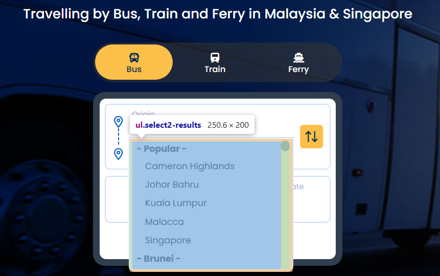
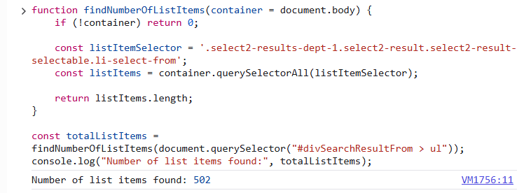
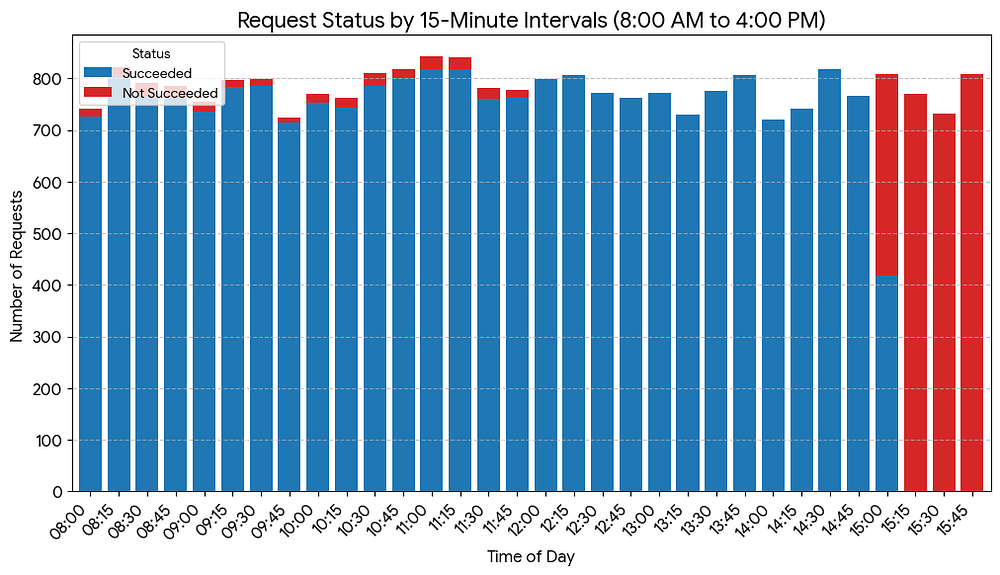
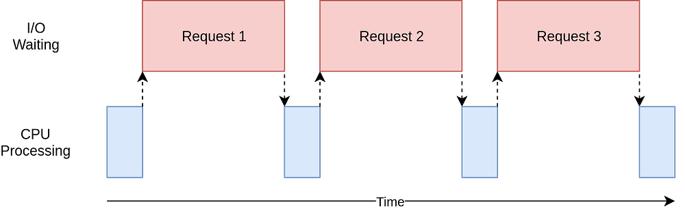
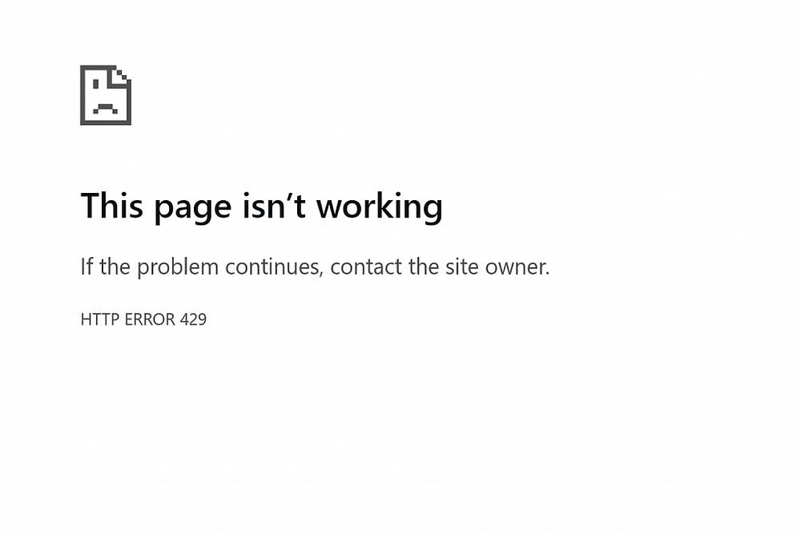
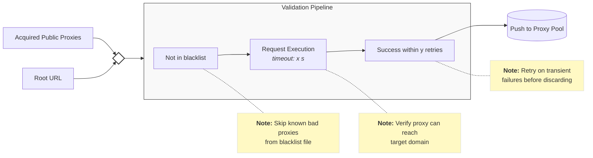
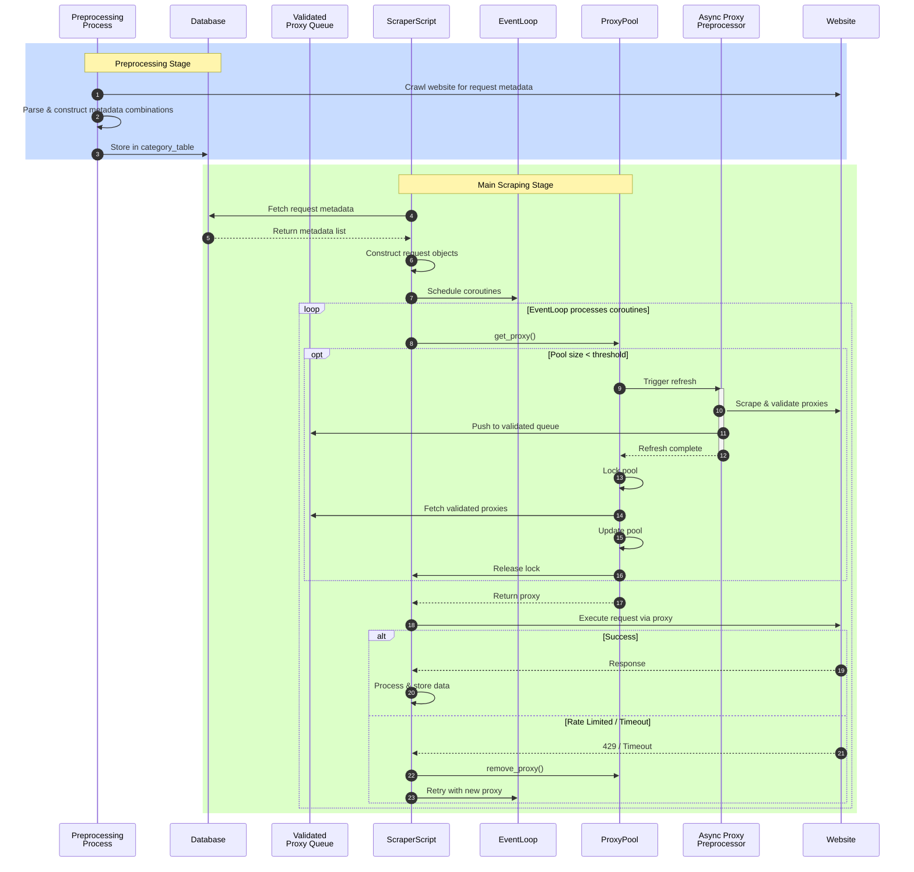

# Building Scalable and Fault-Tolerant Web Scrapers

---

## Introduction
Data is an important foundation for any type of project — whether it's powering a machine learning model, driving business intelligence dashboards, or monitoring real-world trends. 

Yet, in most projects, acquiring the right data is often the most challenging step. The difficulties stem from two key factors:
- **Volume** — Do we have sufficient data to produce statistically meaningful insights?
- **Coverage** — Is the data representative enough to avoid bias and capture the full scope of the problem?

> This is where web scraping becomes essential — it allows us to control what data we collect and how we collect it, all at scale.

---

## Problem
Web scraping may sound trivial at first — "Just extract content from an HTML page". However, even a seemingly simple architecture can quickly render your scraper unusable when faced with real-world conditions.

### 1. Throughput
In most cases, websites do not publicly present all of their data on a single endpoint — as a series of interactions are required to expose a partial / specific-category of the complete data.

#### Scenario: Analyzing bus ticket pricing in Malaysia

Ticket data are commonly categorized based on the origin, destination and departmentDate.

Let's say we want to scrape for all available bus tickets on this specific day.

**Workload Analysis:**


- Number of supported Points-of-Interests (N): 502

- Total workload (worst-case): $N * (N-1) = 502 * 501 = 251,502$ requests!

**Trivial Workflow:**
```python
import requests

session = requests.Session()

# Assuming that each category (origin -> destination) is already acquired.
for origin, destination in category_data:
    payload = {"origin": origin, "destination": destination}
    try:
        response = session.post(ENDPOINT, data=payload, timeout=10)
        response.raise_for_status()
        append_to_log(response.json())
    except requests.RequestException as e:
        print(f"Error fetching {origin} → {destination}: {e}")

session.close()
```

**Analysis:**



After 8 hours of continuous execution:
- ~22,000 succeeded
- ~3,000 timed out
- ~226,000 never executed

> The scraper spent an entire workday processing less than 10% of its total workload.

### 2. Availability
As execution progressed, we can observe from the analysis that a large distribution of failed requests occurred during end of the execution. 

> This relationship aligns with a technique called **rate-limiting** which are used to throttle excessive traffic coming from the same origin.

---

## Solution #1: Concurrency
At surface, the workload appears to be inherently sequential. Each category of data is obtained through independent HTTP calls. Therefore, algorithmic optimizations are limited here.

Let's consider optimizations on the system-level.

**Question**: 
Are there dependencies between each request?

**Answer**:
In our scenario, each ticket are independent of one another and can be executed separately.

With that in mind, let's introduce a preprocessing step.

### Preprocessing
The goal of this step is to bundle all time-consuming modular operations so we that we can parallelize them later on. In our case, we will construct all combinations of ticketing requests in advance.

**Concerns**
- **Would this be applicable when dependencies exists?** 
> Depending on the extent/level of dependencies. If endpoints are deeply rooted across many different branches (with respect to N), the preprocessing step may have to be decomposed into separate steps/layers. In essence, it is important to analyze the tradeoff between preprocessing overhead and theoretical speed-up.

### Choosing a Model
Network requests are I/O bound tasks, where the primary bottleneck is I/O Latency, not CPU computation. 



In Python, we have a few concurrency model to choose from:
- Multi-processing
- Multi-threading
- Asynchronous I/O

#### 1. Multi-processing

**Verdict:** Not ideal.

**Resource Overhead**

Each process requires its own memory space and interpreter instance. In a workload requiring high concurrency, this can lead to excessive resource usage which are undesirable when we are working with limited resources.

**Data Ingestion Challenges**

Process have their own memory space. Ingesting scraped data into a data-source requires careful consideration.

- **Individual Ingestion:** Every process handles its own data persistence. While frequent writes are necessary to ensure data is backed up during long runs, this often leads to race conditions. Without locking mechanisms, multiple processes attempting to write to the same data source can cause data corruption.
- **Bundled Ingestion:** Requires Inter-Process Communication to aggregate data which contributes to overhead issue.

#### 2. Multi-threading

**Verdict:** Viable.

**I/O Concurrency**

The Global Interpreter Lock (GIL) is frequently misunderstood as a total blocker for concurrency. In reality, GIL is released during I/O-bound tasks, allowing multiple threads to wait for network responses in parallel. This enables threading to achieve high throughput for web scraping without the overhead drawback of multiprocessing.

**Context Switching and Synchronization**

Despite being lighter than processes, threads are managed by the OS. Scaling to thousands of concurrent requests results in high context-switching overhead where CPU time is wasted on thread management.

#### 3. Asynchronous I/O (asyncio)

**Verdict**: Optimal.

> **Key Concepts**
> 1. Event Loop: Manages scheduled coroutines and their execution.
> 2. Coroutines: Function that can pause and resume their executions.

In essence, this model achieves concurrency via an event-driven architecture where coroutines can yield control back to the event loop during I/O operations. 

**Resource Overhead**

An asyncio event loop operates on a single thread. Coroutines share memory space, enabling thousands of concurrent connections without thread/process overhead.

**Context Switching**

Implicit context switching — concurrency behavior can be manually controlled using await `await` statements as opposed to OS controlled with processes and threads.

In addition, resolving race conditions will be easier because behavior of context switching is traceable.

---

## Solution #2: Distribution



Concurrency amplifies rate-limiting issues (HTTP 429: Too Many Requests). To address this, we need a way of distributing requests across multiple sources.

In this article, we will document the use of **Proxy Servers**.

> A proxy server is an intermediary that forwards requests
between clients and servers, acting on behalf of the
client to access resources.

Going along with the theme of limited resources, we will be using public proxy servers.
- **Advantage:** Free and abundant, enabling our scrapers to scale easily.
- **Disadvantage:** Performance and reliability degrade over time due to overuse and latency.

### Challenge Analysis
1. **Problem:** A large distribution of proxies are unusable causing failed requests to fail which bottlenecks the throughput.
   - **Solution:** Preprocessing Proxy Servers Asynchronously.
2. **Problem:** Proxies servers are not long-lasting, we need a way of tracking usable ones and revoking expired ones.
   - **Solution:** Managing Proxy Servers.

### Preprocessing Proxy Servers Asynchronously



The validation step is straightforward, we filter out proxy servers that cannot access the root endpoint of the website.

However, this additional step can be very time-consuming and hog the main scraper's execution.

Therefore, we need an efficient way of integrating this.

#### Integration



Instead of coupling proxy validation with the main scraping event loop, we offload the preprocessing workload to a separate process. We can use **Redis pub/sub** for Inter-Process Communication (IPC).
